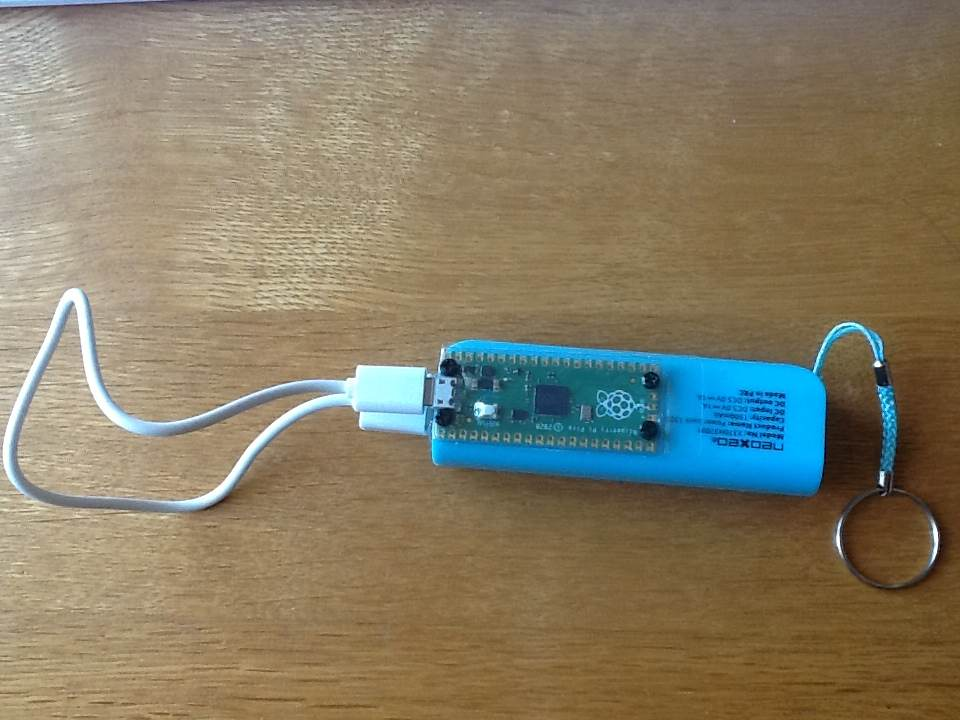

# pico-30minutes
RaspberryPi Pico LED flashes a few times (x30), every 30 minutes, to remind you to get up and stretch.

The code for this project is below. It is flashed to the Pico so that it runs when plugged in to a battery/power. To flash to the Pico, connect the Pico to your computer with a data usb connection while holding down the reset button. Then, open Thonny Python IDE to create the file and then Save As onto the Pico, with filename *main.py* so it will automatically start when plugged in.


```
from machine import Pin
import time

led = Pin(25, Pin.OUT)

def dot():
    led.value(1) #1
    time.sleep(0.3)
    led.value(0)
    time.sleep(0.5)

while True:
    for x in range(30):
        dot()
    # wait half an hour = 1800s
    time.sleep(1800)
    
```

# Example usage
Here, the Pico is attached to a power bank, which I carry around with a cable with me anyway. With the Pico now attached, it can also be used to remind me to get up and stretch when I am at my computer desk for too long. It is attached with 4x separator screws and is protected with the plastic cover it came with when attached to a magazine.



